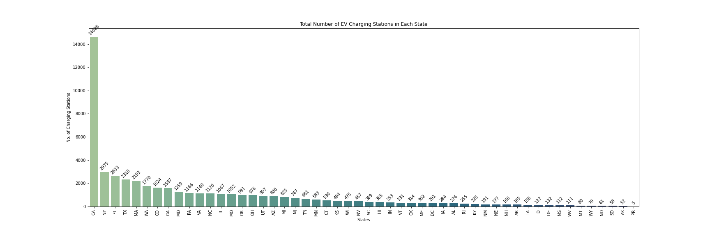
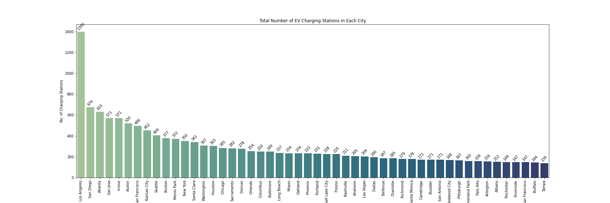

# ev-station-mapping

## Objective
To map out the growth of electric vehicle charging stations across the United States.

## Analysis
 * Tableau Dashboard: https://public.tableau.com/views/EVStationAnalysis/Dashboard1?:language=en-US&:display_count=n&:origin=viz_share_link

Displays the total amount of charging stations in each state.

Displays the total amount of charging stations in the top 50 cities.

Displays how many charging stations were opened each year. The source did not contain complete data from the year 2022.

Displays the total amounts of each connector type present at all stations.

## Credits
Electric Vehicle Charging Stations (ev_stations_v1.csv)
 * CSV source: https://www.kaggle.com/datasets/prasertk/electric-vehicle-charging-stations-in-usa
 * Data source: https://developer.nrel.gov/docs/transportation/alt-fuel-stations-v1/all/#request-url